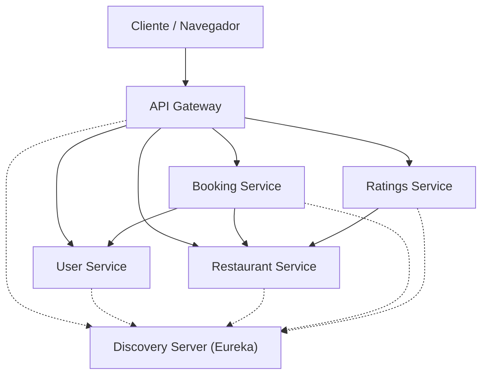

# Booking system for restaurants - Microservices.

This project is a strong base for a booking app developed under a microservices architecture. The main purpose of it is to show a practical understanding of the distributed system design patterns, the communication between services and Spring Cloud ecosystem.

## System Architecture

The system is compounded by 6 microservices which work together to offer functionality related to the management of users, restaurants, ratings and bookings. The communication is available through an API Gateway and an Eureka server.

## How to get started

You can launch the project following the next requirements and steps:

**Requirements**
*    JDK 17 or above.
*    Maven 3.3.2+.
*    Your fav IDE (mine is VS Code, but will work aswell in IntelliJ, Eclipse...)

**Steps:**
1.  Clone the repository.
2.  Go to the project's root.
3.  Use 'mvn clean install' to build all the modules (or type .\any-service\mvnw.cmd clean install).
4.  From the main class of each microservice, iniciate them one by one following the next order:
    1.  'DiscoveryServerApplication'
    2.  Microservices ('UserServiceApplication', 'RestaurantServiceApplication', 'BookingServiceApplication' or 'RatingServiceApplication'). The order doesn't matter for them.
    3.  'ApiGatewayApplication'
5.  The system should be ready now and the API Gateway listening on 'http://localhost:8080'
